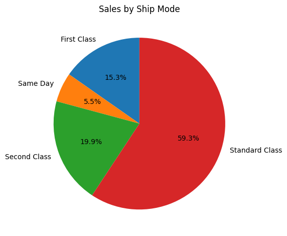

# 🧠 Mock LLM-Powered Query Assistant for Tabular Data

This project simulates a **local, no-API** smart assistant that translates natural language prompts into working pandas/matplotlib code, mimicking how an LLM like GPT-4 would interpret and execute queries on tabular business data.

---

## 📌 Why This Project Matters

Most enterprise use cases require analysis of structured data (like retail or customer records), but using live LLM APIs can be expensive or privacy-restricted. This project demonstrates how to:

- Map natural language → Python code using custom prompt mappings
- Execute safe and interpretable pandas/matplotlib code
- Auto-generate and save charts in a reproducible `outputs/` folder
- Build a prototype LLM data assistant with **zero cost**

---

## 📂 Dataset Used

We used the Superstore Sales dataset (`train.csv`), containing:

- Over **9,000** transaction records
- **17 columns** like `Sales`, `Category`, `Region`, `Ship Mode`, `Order Date`
- Multivariate data across geography, customer segments, and time

---

## 🔧 Tools and Libraries

- Python (3.11+)
- pandas
- matplotlib
- seaborn
- Jupyter Notebook

---

## 📁 Folder Structure

```
mock-llm-tabular-assistant/
├── query_assistant.ipynb         ← Full notebook
├── prompts/
│   └── prompt_map.json           ← Natural language → code mappings
├── data/
│   └── train.csv                 ← Superstore dataset
├── outputs/
│   ├── plot_sales_by_category.png
│   ├── plot_sales_by_subcategory.png
│   ├── plot_monthly_sales_trend.png
│   └── plot_sales_by_ship_mode.png
└── .gitignore
```

---

## 💬 Sample Prompts and Visualizations

---

### ▶️ `plot total sales by category`

```python
category_sales = df.groupby("Category")["Sales"].sum()
category_sales.plot(kind="bar", title="Total Sales by Category", color="orchid")
plt.xlabel("Category")
plt.ylabel("Sales")
plt.tight_layout()
plt.savefig("../outputs/plot_sales_by_category.png", bbox_inches="tight")
plt.show()
```

**📊 Output:**


**Insights:**

- 📦 Technology: $836,154.03  
- 🛋️ Furniture: $741,999.80  
- ✏️ Office Supplies: $719,047.03  
- Technology leads, contributing **36.4%** of total sales.

---

### ▶️ `plot sales vs sub-category`


- Phones and Chairs are top-grossing subcategories.
- Together they contribute **over 20%** of all sales.
- Supplies like Paper and Binders rank lower in revenue.

---


### ▶️ `plot sales distribution by ship mode`



- 🟪 Standard Class dominates at **59.3%**
- Same Day shipping is only used for **6.1%** of transactions.
- Valuable insight for shipping policy or marketing strategy optimization.

---

## 🚀 Highlights

- No OpenAI or external API required — 100% local simulation
- Outputs are automatically saved to `/outputs` for portfolio and GitHub proof
- Clean separation between input (natural prompt) and logic (code execution)
- Portable and editable with zero-cost dependencies

---

## ✅ Future Ideas

- Add fuzzy matching for unseen questions (regex, keyword logic)
- Include classification, filtering, or grouping logic
- Build a Streamlit interface for real-time assistant use
- Add AI safety checks for user-submitted code

---

## 🧑‍💻 Author Info

**Name:** Alexus Glass  
[GitHub](https://github.com/lexusimni)  
[LinkedIn](https://www.linkedin.com/in/alexus-glass-248061237/)

---
